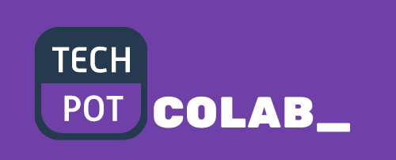
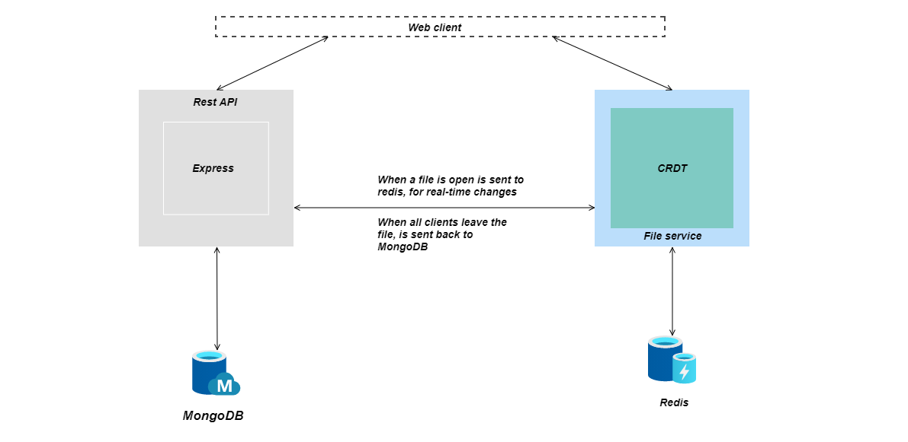

<p align="center">
<a href="">

</a>
</p>

<p align="center">


</p>

<h4 align="center">
In-browser collaborative code editor.
</h4>


## ⭐ Features

-   In-browser IDE with VS Code like text editor.
-   Some features like auto-completion and code-formatting
-   Supports for 9 languages
-   Realtime Collaboration
-   Multi-files

> ⚠️ *Website isn't mobile friendly.*

## 📺 Prerequisites

Before running app locally make sure that you install following things:

-   Install [Docker](https://docs.docker.com) and [Docker Compose](https://docs.docker.com/compose).
-   Install [make](https://stackoverflow.com/questions/32127524/how-to-install-and-use-make-in-windows#54086635)   


## 🚀 Local Development

### Step 1: Clone the repo

```bash
https://github.com/PedroMiotti/colab-editor-api
```

### Step 2: Configuration

1. Create `.env` file in project root dir

    ```bash
    $ touch .env
    ```

2. Copy everything from `.env.example` as paste it in `.env`

## Step 3: Run container

```bash
# Run docker-compose (API, Redis and Mongo)
$ make up
```

## 🧱 Basic architecture

<p align="center">

</p>

## 📝 License

This project is [MIT](https://github.com/adarshaacharya/CodeTreats/blob/master/LICENSE) licensed.
